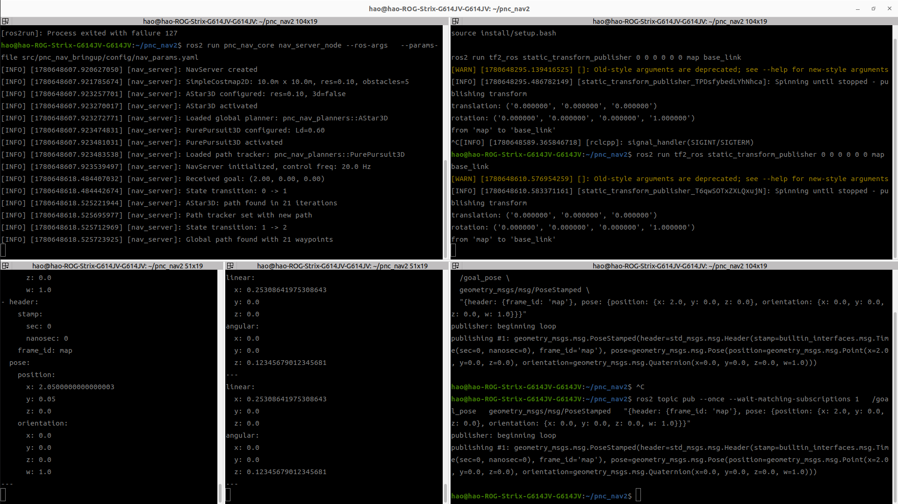

已经验证了整个 pnc_nav_core 的 Phase 1 流程是通过的。

注意：本文早期记录里提到的 `SimpleCostmap2D` 是最小流程验证用的旧路径。
当前主实现已经切到 `Nav2CostmapAdapter`，通过订阅 `map_server` 发布的 `/map`
(`nav_msgs/msg/OccupancyGrid`) 为 AStar2D 提供代价地图。

## pnc_nav_core 最小流程验证


```text
NavServer 启动
  -> 创建 Nav2CostmapAdapter 并订阅 /map
  -> 加载 AStar2D 全局规划插件
  -> 加载 PurePursuit3D 路径跟踪插件
  -> 接收 /goal_pose
  -> 进入 PLANNING
  -> AStar2D 输出 /global_plan
  -> path_tracker 接收 path
  -> 进入 FOLLOWING
  -> PurePursuit3D 输出 /cmd_vel
```

### 1. 编译

```bash
cd ~/pnc_nav2
colcon build --packages-select pnc_nav_interfaces pnc_nav_core pnc_nav_planners pnc_nav_bringup --symlink-install
source install/setup.bash
```

### 2. 推荐启动 Phase 1 可复现入口

```bash
cd ~/pnc_nav2
source install/setup.bash

ros2 launch pnc_nav_bringup turtlebot3_test.launch.py
```

该入口会启动 TurtleBot3 Gazebo、`map_server`、`map -> odom` 静态 TF、
`nav_server` 和 RViz。`sim_2d_bringup.launch.py` 当前也复用这条链路，
不再依赖源码树里不存在的 `pnc_nav_sim`。

### 3. 仅启动 NavServer 的最小调试方式

```bash
cd ~/pnc_nav2
source install/setup.bash

ros2 run pnc_nav_core nav_server_node --ros-args \
  --params-file src/pnc_nav_bringup/config/nav_params.yaml
```

启动后观察到：

```text
NavServer created
Nav2CostmapAdapter: subscribed to /map
AStar2D activated
Loaded global planner: pnc_nav_planners::AStar2D
PurePursuit3D configured: Ld=0.60
Loaded path tracker: pnc_nav_planners::PurePursuit3D
NavServer initialized, control freq: 20.0 Hz
```

说明：

```text
NavServer 本体启动成功
Nav2CostmapAdapter 创建成功并订阅 /map
AStar2D 插件加载成功
PurePursuit3D 插件加载成功
```

### 4. 发布静态 TF

因为当前没有 Gazebo 和 odom，所以手动发布一个固定的 `map -> base_link`：

```bash
cd ~/pnc_nav2
source install/setup.bash

ros2 run tf2_ros static_transform_publisher 0 0 0 0 0 0 map base_link
```

这里的作用是让 `NavServer::getCurrentPose()` 能查到机器人当前位姿。

注意：这是静态 TF，机器人位置不会真的变化，所以这次只能验证 core 流程，不能验证真实闭环运动。

### 5. 监听输出话题

监听全局路径：

```bash
cd ~/pnc_nav2
source install/setup.bash

ros2 topic echo /global_plan
```

监听速度指令：

```bash
cd ~/pnc_nav2
source install/setup.bash

ros2 topic echo /cmd_vel
```

### 6. 发布目标点

```bash
cd ~/pnc_nav2
source install/setup.bash

ros2 topic pub --once --wait-matching-subscriptions 1 \
  /goal_pose \
  geometry_msgs/msg/PoseStamped \
  "{header: {frame_id: 'map'}, pose: {position: {x: 2.0, y: 0.0, z: 0.0}, orientation: {x: 0.0, y: 0.0, z: 0.0, w: 1.0}}}"
```

NavServer 端观察到：

```text
Received goal: (2.00, 0.00, 0.00)
State transition: 0 -> 1
AStar2D: path found
Path tracker set with new path
State transition: 1 -> 2
Global path found with 21 waypoints
```

其中：

```text
0 -> 1 表示 IDLE -> PLANNING
1 -> 2 表示 PLANNING -> FOLLOWING
```

`/global_plan` 能看到 path 输出，`/cmd_vel` 能看到 PurePursuit3D 输出速度，例如：

```text
linear.x: 0.253...
angular.z: 0.123...
```

### 7. 验证结论

这次验证说明：

```text
pnc_nav_core 的调度链路已经打通：
goal_pose -> global planner -> global_plan -> path tracker -> cmd_vel
```

已经验证通过的部分：

```text
NavServer 参数加载
Nav2CostmapAdapter 订阅 /map
pluginlib 加载 AStar2D
pluginlib 加载 PurePursuit3D
TF 查询当前位姿
goalCallback 接收目标点
PLANNING 状态调用 createPlan()
global_plan 发布
path_tracker->setPath(path)
FOLLOWING 状态调用 computeVelocityCommand()
cmd_vel 发布
```

这次没有验证的部分：

```text
机器人真实运动
odom 速度反馈
动态 TF 更新
Gazebo 差速小车闭环
局部避障 local_planner
真实 3D costmap / OctoMap / traversability
```

当前因为使用的是静态 TF，`base_link` 一直固定在 `(0, 0, 0)`，所以机器人不会真的接近目标，`cmd_vel` 会持续输出。这是预期现象。

下一步应该接 Gazebo diff_drive，让 `odom -> base_link` 随机器人运动变化，再验证：

```text
cmd_vel -> Gazebo robot movement -> TF/odom update -> NavServer current_pose update -> goal reached
```
---
其他
---

当前nav_server只有对pp和stan的支持，并不支持避障，也就是不支持local_planner.
修正了setplan，path_tracker为空时规划器状态机依旧进入跟随状态的问题，
改变了setplan返回值类型，解决不管setplan做出什么都会导致状态机切换跟随状态的问题;
当前速度订阅直接订的是我们发布的速度，实际场景里可能会因为摩擦打滑限速等导致跑不到这个速度，因此更严谨的做法是订阅odom速度，后续可以优化


---
control_base是更底层的移动步态上的控制，现阶段完全用不到
costmap_interface是我这套的自己做的兼容各类型格式的代价地图，现在基本为空实现，所以基本也用不到
global_planner_base是全局规划器接口
local_planner_base是局部规划器接口
nav_server是调度服务接口
nav2——costmap——adapter我还没看不知道干啥用的
path_tracker_base是追踪的规划器接口
simple_costmap_2d 是早期人造验证路径；当前主路径已经使用 `Nav2CostmapAdapter` 对接 `/map`。
